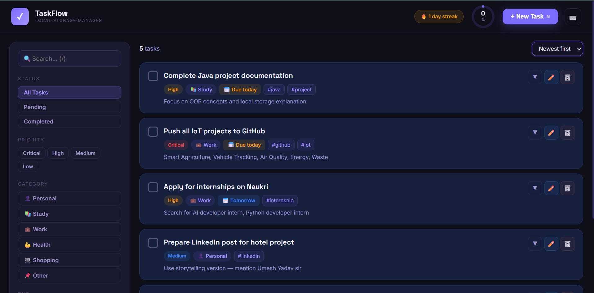
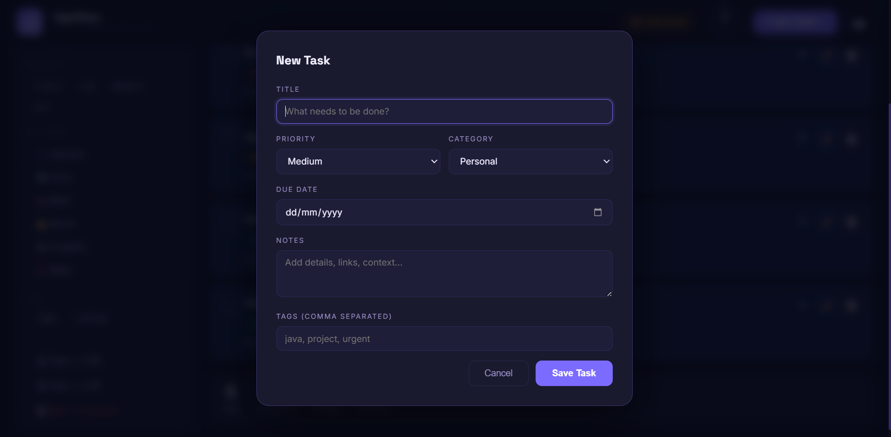
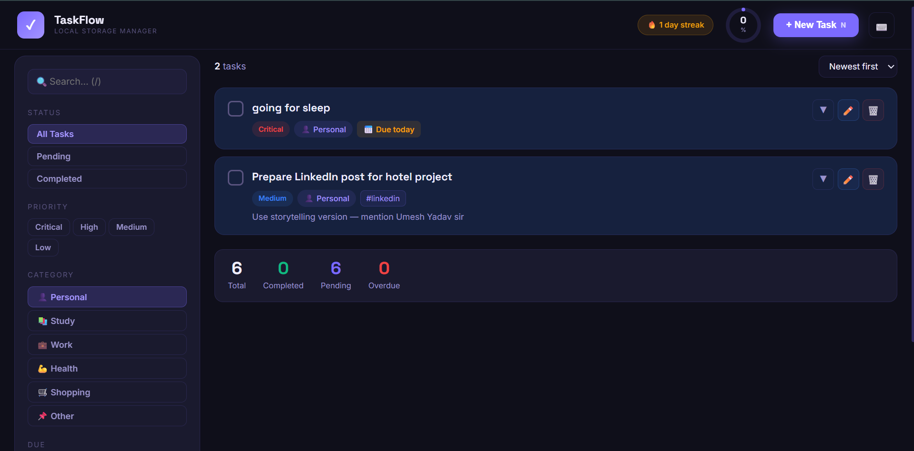
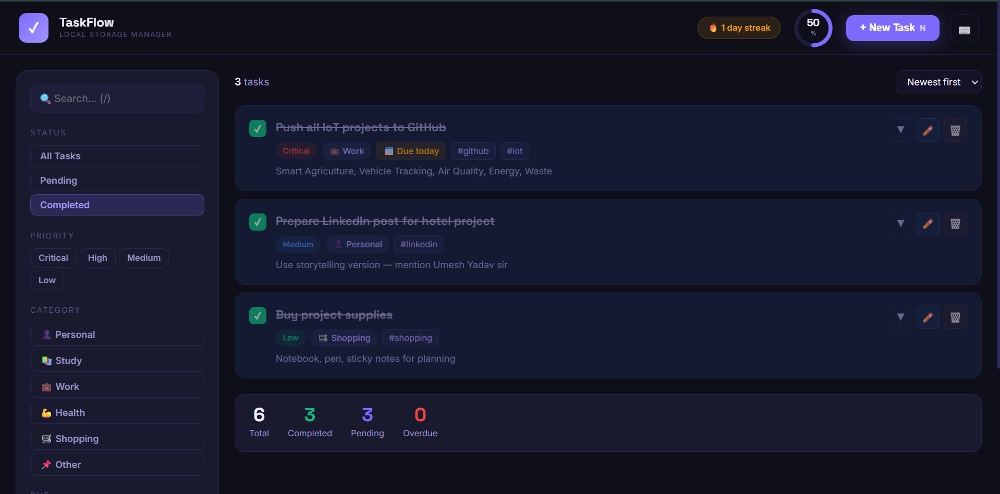
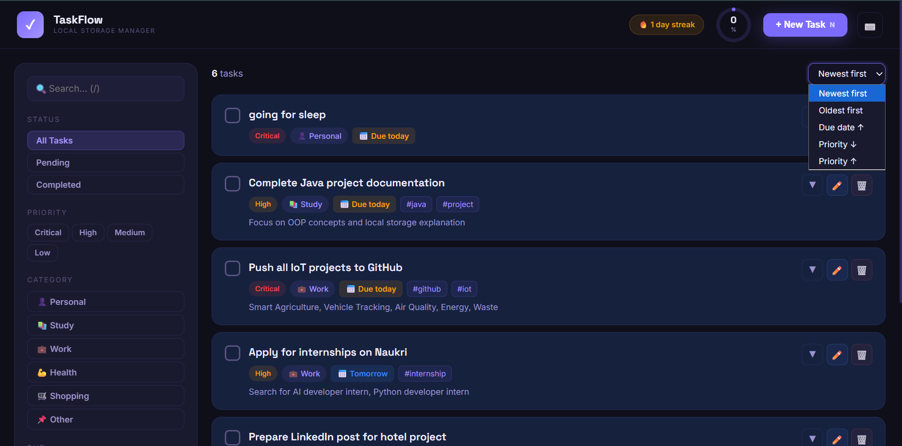
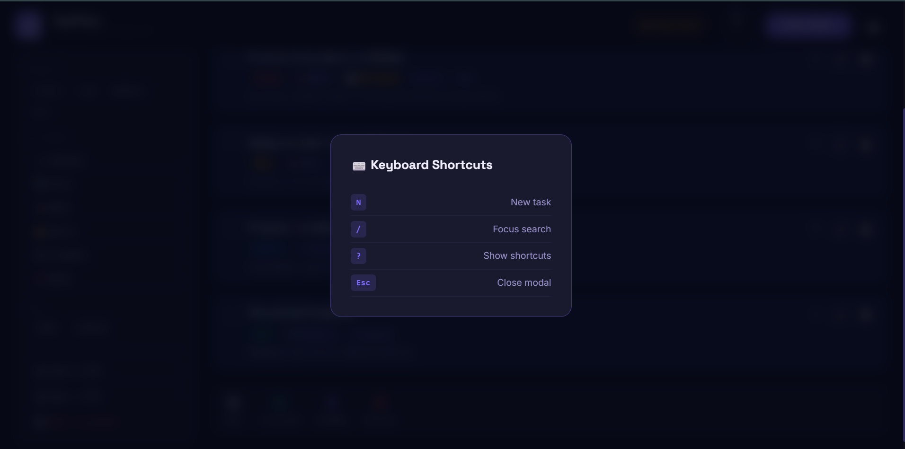
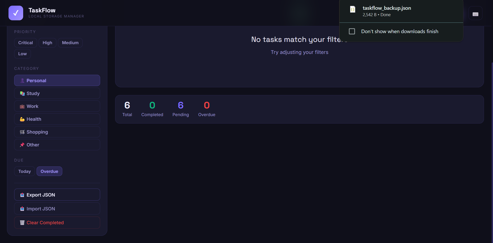

# ✅ TaskFlow — To-Do List Manager with Local Storage

### *Java Console App + Premium Flask Web Dashboard*


**[🌐 Live Demo](https://to-do-list-manager-local-storage.onrender.com)**
&nbsp;&nbsp;·&nbsp;&nbsp;
**[💻 Source Code](https://github.com/Neha-Joshi05/To-Do-List-Manager-Local-Storage)**
&nbsp;&nbsp;·&nbsp;&nbsp;
**[📸 Screenshots](#-screenshots)**


---

## 📸 Screenshots

<div align="center">

### Dashboard — All Tasks View


<br/>

### Add New Task Modal


<br/>

### Filter by Priority & Category


<br/>

### Completed Tasks View


<br/>

### Overdue Tasks — Due Date Labels


<br/>

### Java Console App — Main Menu


<br/>

### Java Console — Summary Report


<br/>

</div>

---

## 🎯 Objective

Build a complete task management application in Java demonstrating
full CRUD operations, file-based local storage, priority and category
management, overdue detection, sorting, filtering, and search — with
a premium deployed Flask web dashboard featuring a live productivity
ring, Pomodoro timer, subtasks, and streak tracking.

---

## 📖 What is TaskFlow?

**Simple explanation:**
A digital to-do list that never forgets. You add tasks, set
priorities and deadlines, and the system alerts you when something
is overdue. Your data is saved locally and loads automatically
every time you open the app.

**Technical explanation:**
A Java application implementing the full task lifecycle using OOP
principles. `Task` is the domain model with `Priority`, `Status`,
and `Category` enums. `TaskService` handles business logic including
date-based overdue detection using `LocalDate`. `FileTaskRepository`
serializes tasks to a local CSV file using `BufferedReader` and
`PrintWriter`. `Comparator` handles multi-field sorting. A companion
Flask web dashboard uses browser localStorage for instant persistence
with no backend database required.

---

## 🔄 Task Lifecycle

```
Task Created (PENDING)
       ↓
Task Updated / Prioritized
       ↓
Status → IN_PROGRESS
       ↓
Due Date Check → Overdue? ⚠️
       ↓
Status → COMPLETED ✅
       ↓
Saved to local file / localStorage
       ↓
Reloaded on next app start
```

---

## ✨ Features

### Web Dashboard (Flask + JavaScript)
| Feature | Description |
|---|---|
| 🔵 **Productivity Ring** | Live SVG progress ring fills as tasks complete |
| 🍅 **Pomodoro Timer** | Per-task 25-min focus timer with pause/reset |
| ✅ **Subtasks** | Add unlimited subtasks inside each card |
| 🔥 **Streak Tracker** | Tracks daily completion streaks |
| 📅 **Smart Due Labels** | Shows "Due today", "Tomorrow", "3d overdue" |
| 🔍 **Live Search** | Instant search across title and notes |
| 🔽 **Filters** | Filter by status, priority, category, due window |
| 🔼 **Sort** | Sort by created date, due date, priority |
| 📤 **Export JSON** | Download full task backup |
| 📥 **Import JSON** | Restore from backup file |
| ⌨️ **Keyboard Shortcuts** | N=new, /=search, ?=shortcuts |
| 💾 **LocalStorage** | Data persists across browser refreshes |

### Java Console App
| Feature | Description |
|---|---|
| ➕ Add task | Title, description, priority, category, due date |
| 📋 View all | Display all tasks with status and overdue indicator |
| ✏️ Edit task | Update title and due date by task ID |
| ✅ Mark complete | Change status to COMPLETED |
| 🔄 Mark pending | Reset status to PENDING |
| 🗑️ Delete task | Remove with confirmation prompt |
| 🔍 Search | Case-insensitive search in title and description |
| 🔽 Filter | Filter by PENDING, IN_PROGRESS, COMPLETED |
| 🔼 Sort | Sort by priority Critical → Low |
| ⚠️ Overdue | Detect and display all overdue tasks |
| 📊 Summary | Full stats report by status, priority, category |
| 💾 Local save | Auto-save to `data/tasks.csv` on every change |

---

## 🏭 Industry Relevance

Task management systems power real products used daily:

| Product | Technology Used |
|---|---|
| **Jira** | Task tracking, priority, assignee, sprints |
| **Trello** | Card-based task boards with labels |
| **Asana** | Project task management with due dates |
| **Notion** | Task databases with filters and sorts |
| **Todoist** | Personal task manager with priority levels |
| **Microsoft To Do** | Daily task planning with reminders |

The same core logic — CRUD, priorities, due dates, filters, persistence —
runs inside every one of these billion-dollar products.

---

## 🛠️ Tech Stack

| Layer | Technology |
|---|---|
| Console App | Java 17, Collections, Enums, LocalDate |
| File Storage | CSV with BufferedReader + PrintWriter |
| Web Backend | Python 3, Flask |
| Web Frontend | HTML5, CSS3, Vanilla JavaScript |
| Browser Storage | localStorage (JSON) |
| Fonts | Space Grotesk + Inter (Google Fonts) |
| Deployment | Render (free tier) |
| Version Control | Git + GitHub |

---

## 🔑 Java Concepts Used

| Concept | How It's Used |
|---|---|
| **Classes & Objects** | `Task` model with all fields and behaviour |
| **Enums** | `Priority`, `Status`, `Category` — type-safe options |
| **Encapsulation** | Fields and methods grouped inside `Task` class |
| **ArrayList** | `List<Task>` stores all tasks in memory |
| **Streams & Lambdas** | `.filter()`, `.sorted()`, `.count()` on task list |
| **Comparator** | `Comparator.comparingInt()` for priority sort |
| **LocalDate** | Due date parsing and overdue detection |
| **File Handling** | `BufferedReader` to load, `PrintWriter` to save CSV |
| **Exception Handling** | `try/catch` for file I/O and date parsing |
| **String methods** | `.split()`, `.trim()`, `.toLowerCase()` for CSV + search |
| **CRUD** | Create, Read, Update, Delete task operations |

---

## 🏗️ Architecture

```
┌──────────────────────────────────────────────────────┐
│                  USER INTERFACE                      │
│       Java Console  /  Flask Web Dashboard           │
└──────────────────────┬───────────────────────────────┘
                       │
┌──────────────────────▼───────────────────────────────┐
│                BUSINESS LOGIC                        │
│  • Task CRUD (add, view, update, delete)             │
│  • Priority / Category / Status management           │
│  • Due date overdue detection (LocalDate)            │
│  • Search, filter, sort (Streams + Comparator)       │
│  • Streak calculation                                │
└───────────────────────┬──────────────────────────────┘
                        │
┌──────────────────────▼───────────────────────────────┐
│                  DATA STORAGE                        │
│  Java: data/tasks.csv  (BufferedReader/PrintWriter)  │
│  Web:  browser localStorage (JSON key: tdms_v1)      │
└──────────────────────────────────────────────────────┘
```

---

## 📁 Folder Structure

```
To-Do-List-Manager-Local-Storage/
│
├── java_app/
│   └── ToDoApp.java              ← Complete Java console app
│
├── dashboard/
│   ├── app.py                    ← Flask server (serves index.html)
│   └── templates/
│       └── index.html            ← Premium web dashboard
│
├── data/
│   └── tasks.csv                 ← Auto-generated local task file
│
├── screenshots/                  ← Proof of work images
│   ├── 01_dashboard.png
│   ├── 02_add_task.png
│   ├── 03_filters.png
│   ├── 04_expanded_task.png
│   ├── 05_completed.png
│   ├── 06_overdue.png
│   ├── 07_java_console.png
│   ├── 08_java_summary.png
│   └── 09_github.png
│
├── docs/                         ← Architecture diagrams
├── outputs/                      ← Sample outputs
├── requirements.txt              ← Python dependencies
├── Procfile                      ← Render deployment config
├── .gitignore
└── README.md
```

---

## 🚀 How to Run

### Option A — Web Dashboard (Flask)

```bash
# Clone repo
git clone https://github.com/Neha-Joshi05/To-Do-List-Manager-Local-Storage
cd To-Do-List-Manager-Local-Storage

# Install dependencies
pip install -r requirements.txt

# Run dashboard
python dashboard/app.py

# Open in browser
http://localhost:5000
```

### Option B — Java Console App

```bash
# Navigate to java_app
cd java_app

# Compile
javac ToDoApp.java

# Run
java ToDoApp
```

### Option C — IntelliJ IDEA

1. **File → Open** → select `java_app` folder
2. Set Java SDK → **17 or higher**
3. Right-click `ToDoApp.java` → **Run 'ToDoApp.main()'**

---

## 📊 Sample Console Output

```
╔═══════════════════════════════════════════╗
║     TaskFlow — To-Do List Manager          ║
║     Java Console | Local Storage           ║
╚═══════════════════════════════════════════╝

  ✅ Loaded 5 tasks from local storage.

══════════════════ MENU ══════════════════
  Tasks: 5 total | 3 pending | 1 overdue
  1. ➕ Add Task
  2. 📋 View All Tasks
  ...

══════════════ SUMMARY REPORT ══════════════
  Total tasks   : 5
  Pending       : 3
  In Progress   : 1
  Completed     : 1
  Overdue       : 1

  By Priority:
    LOW       : 1
    MEDIUM    : 2
    HIGH      : 1
    CRITICAL  : 1

  By Category:
    PERSONAL  : 1
    STUDY     : 2
    WORK      : 2
════════════════════════════════════════════
```

---

## 🧪 Test Cases

| Test | Input | Expected |
|---|---|---|
| Add valid task | Title + priority + due | Task created ✅ |
| Empty title | No title | Validation error ❌ |
| Invalid due date | `abc` as date | Handled gracefully ❌ |
| Mark complete | Valid task ID | Status → COMPLETED ✅ |
| Mark pending | Completed task ID | Status → PENDING ✅ |
| Delete task | Valid ID + confirm y | Task removed ✅ |
| Delete task | Valid ID + confirm n | Task kept ✅ |
| Search | Partial title match | Matching tasks shown ✅ |
| Overdue check | Past due date + pending | Marked overdue ⚠️ |
| File missing | No tasks.csv | Starts fresh ✅ |
| Restart app | After adding tasks | Tasks reload ✅ |

---

## ⌨️ Keyboard Shortcuts (Web Dashboard)

| Key | Action |
|---|---|
| `N` | New task modal |
| `/` | Focus search bar |
| `?` | Show shortcuts overlay |
| `Esc` | Close modal |

---

## 🔮 Future Improvements

- SQLite database integration for Java app
- Spring Boot REST API backend
- React Native mobile app
- Recurring tasks (daily, weekly)
- Reminder notifications
- Team collaboration features
- Calendar integration
- AI task prioritization
- Dark / Light theme toggle
- Drag-and-drop task reordering
- Voice-to-task input


---


## 👤 Author

**Neha Joshi**
- GitHub: [@Neha-Joshi05](https://github.com/Neha-Joshi05/To-Do-List-Manager-Local-Storage)
- LinkedIn : https://www.linkedin.com/in/neha-joshi-0851a2322?utm_source=share_via&utm_content=profile&utm_medium=member_android

<div align="center">
<br/>

<br/><br/>

*Built with ☕ Java + 🐍 Python · Deployed on Render*

</div>